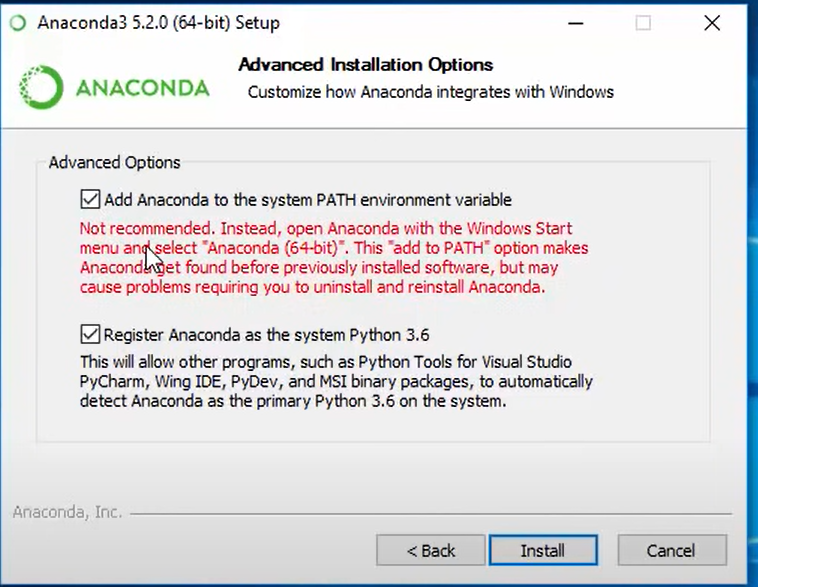
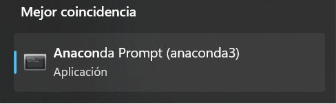
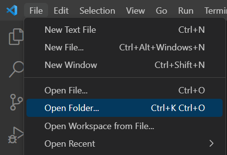
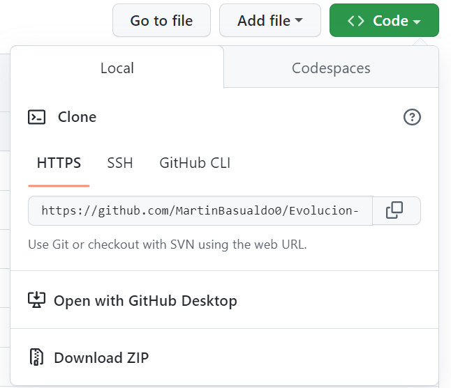
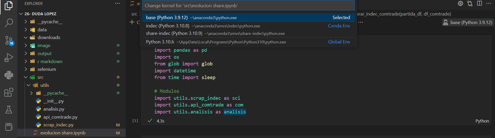
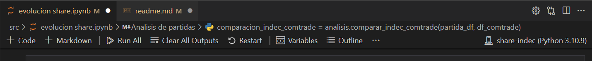

# Evolución del share de las exportaciones Argentinas con datos del INDEC

La idea fue recrear el análisis de la evolución del _share_ del comercio Argentino utilizando como fuente de datos para las exportaciones argentinas al INDEC. Esto se realiza a sabiendas que a partir de marzo del 2018 hubo un quiebre con la metodología al presentar los datos relevantes para el presente trabajo con secreto estadístico.

## Si no tengo python instalado

- Instalar python: https://www.python.org/downloads/
- Instalar anaconda siguiendo paso a paso este [tutorial](): https://www.anaconda.com/products/distribution
  Especialmente, en esta parte:

  
- Instalar vs code: https://code.visualstudio.com/

## Librerías requeridas

Una vez instalado los programas necesarios, abrir el _anaconda prompt._

Y escribir el siguiente comando que creará un ambiente llamado "share-indec" con las librerías requeridas. Darle a enter dos veces (para confirmar).

`conda create -n share-indec pip pandas plotly ipykernel nbformat selenium requests`

Abrir el Visual Studio Code y abrir la carpeta donde se descargó el proyecto

_Si no se descargó el proyecto, en la página de github (donde se está leyendo esto), hacer click en code, luego en download ZIP. Descomprimir el archivo, y volver a intentar abrir la carpeta desde el vs code._

Una vez abierto el proyecto, en la carpeta src está el Jupyter Notebook "evolucion share.ipynb". Ese es el archivo que interesa. Click en el botón que se encuentra arriba a la derecha "base (Python ...)" donde seleccionamos el kernel "share-indec" con las librerías requeridas ya descargadas.

Lo último, correr todo el programa con "run all". Recomiendo poner que no todas las veces que el programe pregunte por hacer algo, en caso contrario, podría llevar horas.

## Metodología resumida:

- Fijación del período de análisis, respetando al trabajo original.
- _Scrap_ de los datos publicados por el INDEC para las exportaciones.
- Consulta a la API de COMTRADE.

Filtros a los datos:

- Las partidas tienen que haber sido exportadas todos los años bajo análisis.
- Su participación en el comercio internacional tiene que ser relevante (se mantuvo el 0,1%).
- No tiene que presentar una diferencia significativa a lo reportado por COMTRADE. En realidad, importa que los datos de COMTRADE no sean significativamente mayores a los del INDEC, lo que indicaría que el secreto estadístico en dicha partida es sustantivo.
